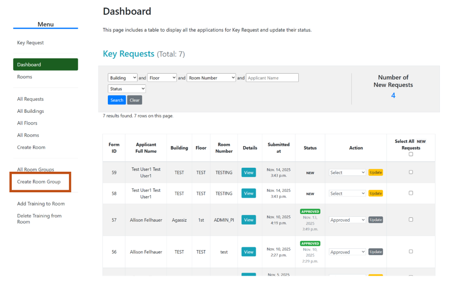
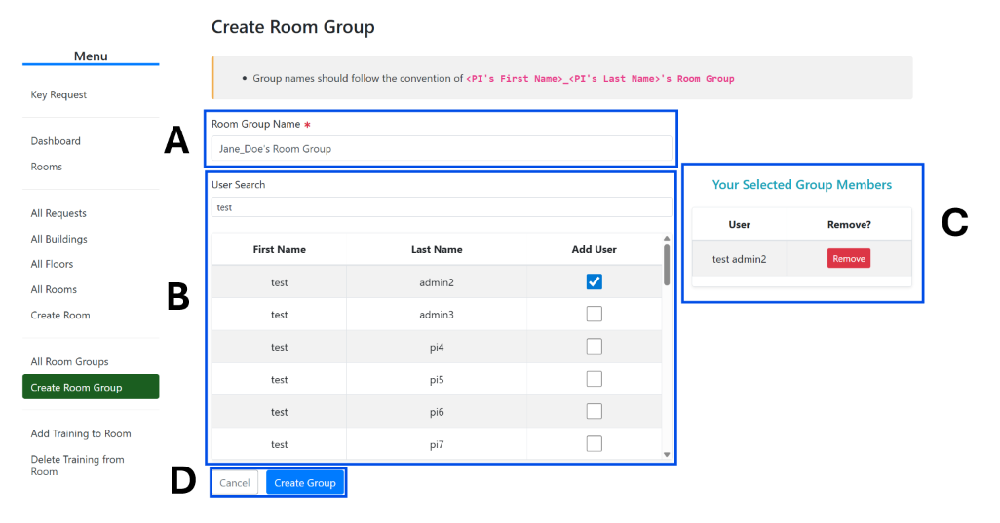
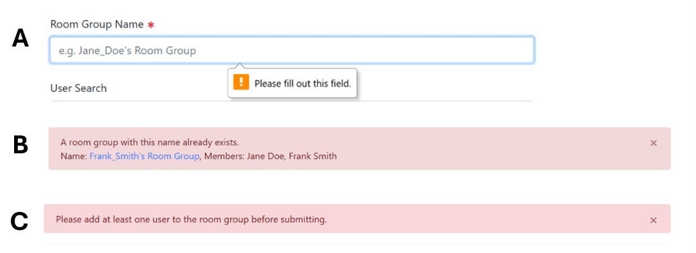
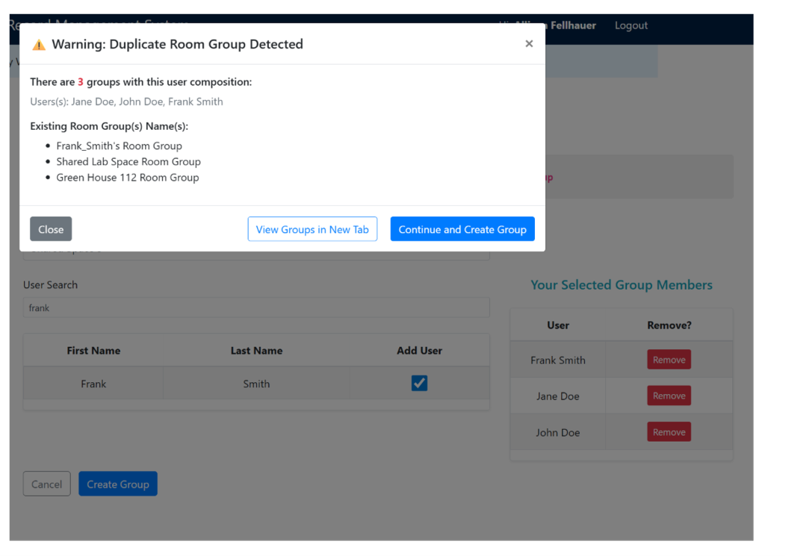
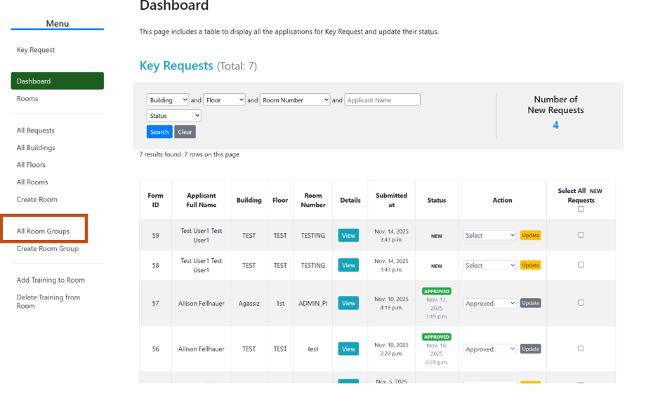
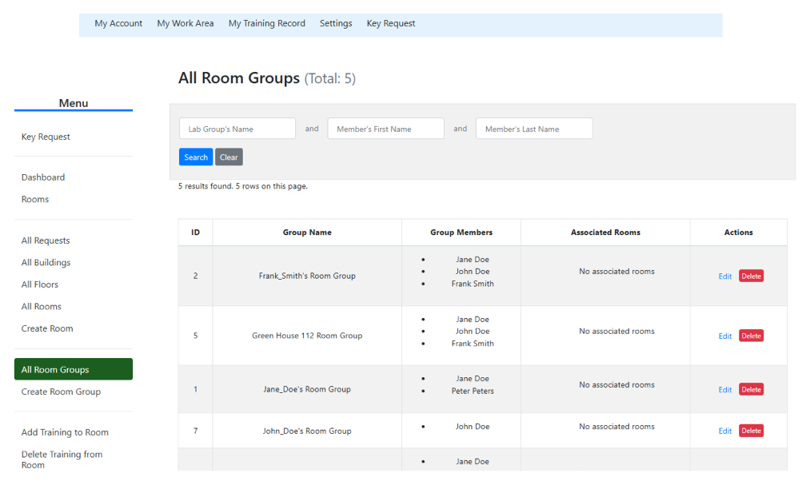
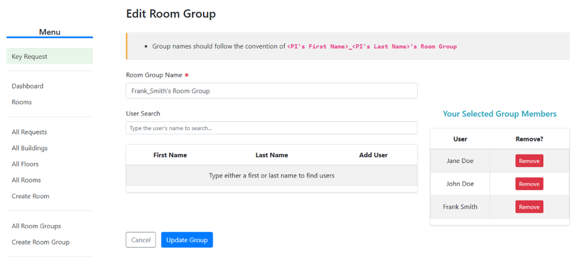
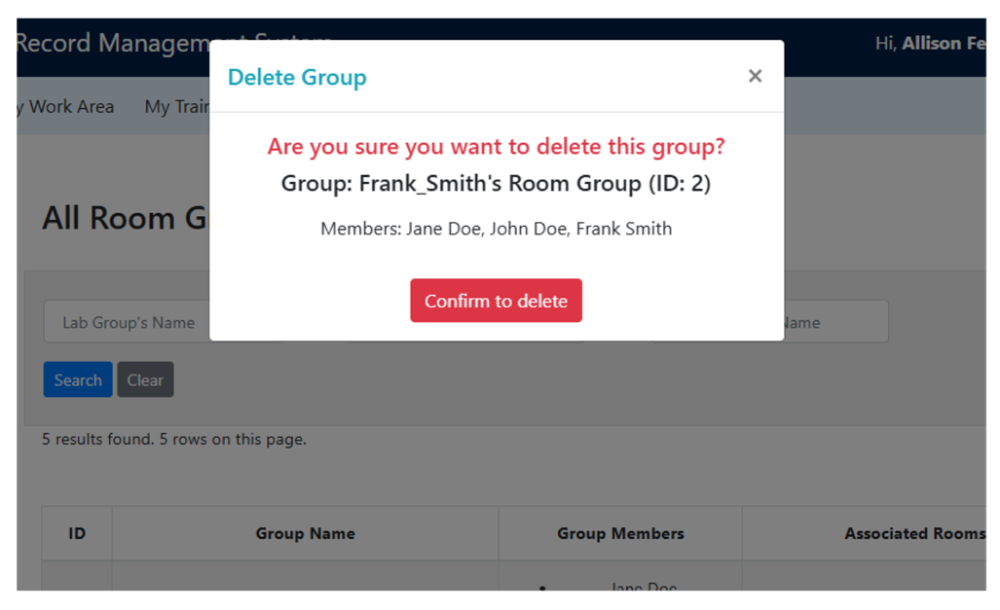

# TMRS: Group Management Feature
For key requests, rooms can be associated with groups in addition to individual PIs. Any members belonging to a group associated with a PI can approve a key request on behalf of the entire group.
## 1.0 Managing Groups
### 1.1 Create Group Page
Groups can be created by navigating to the ‘Create Room Group’ tab located on the left hand side menu (Figure 1.1).

**Figure 1.1**: Position of the Create Room Group tab located on the left hand side menu.

On the Create Group page (Figure 1.2), admins must specify the group’s name in the Room Group Name text box (Figure 1.2a), adhering to the convention of **<PI’s First Name>_<PI’s Last Name>’s Room Group** for regular groups. This convention is not enforced by the system. 

Figure 1.2: Components of the Create Room Group page with selected users and search results: a) the text box for entering the room group’s name, b) the user search bar and the results table, c) the Your Selected Group Members table, d) Create Group and Cancel buttons.

Users can be searched using the User Search bar (Figure 1.2). Typing in the search bar will automatically filter and display user’s matching the search result. Selecting the checkbox beside the user’s name will add the user to the Your Selected Group Members table (Figure 1.2c) located on the right side of the page. Clicking the Delete button located beside the user’s name in the Your Selected Group Members table will remove the user from the group. Clicking the Create Group button will finish the group’s creation, if and only if none of the Create Group Form rules are violated.

#### Room Group Form Rules

The Room Group form enforces three rules:
1.	A Room Group must have a name; 
2.	A Room Group must have a unique name; and
3.	A Room Group must have at least one member.
The admin will be informed if any of the above rules are violated. See Figure 1.3 for the appearance of the alerts.

Figure 1.3: Alerts for violating the of the Create Group form rules: a) alert (tooltip) for leaving the Room Group’s name blank, b) alert for attempting to create a group with a duplicate name, and c) alert for creating a group without any users. 

#### Creating a Duplicate Group
If a group is made with identical composition (otherwise, the exact same members) as a different group, the admin will be alerted after clicking the Create Group button. See Figure 1.4 below for the appearance of the pop-up alert.

Figure 1.4: Alert when the system detects that the admin is attempting to make a group with the same group members as a group that already exists. 

The popup consists of a warning message, the members of the group, and a list of existing groups that have the same membership. The admin has three options:
1.	Close the alert;
2.	View the existing groups in a new tab; or
3.	Continue and create the group. 

Clicking the View Groups in New Tab button will show a search result of each group with the same membership and clicking the Continue and Create Group will proceed with the creation of the group.
This is a guard that allows the admin to view existing groups and help prevent duplicate group creation. The admin is always permitted to make groups with identical composition.

### 1.2 All Room Groups Page
The All Room Groups page can be accessed by clicking the All Room Groups tabs located on the left side menu of the Key Requests page (Figure 1.5).

Figure 1.5: Position of the All Room Groups tab located on the left hand side menu.

On the All Room Groups page (Figure 1.6), admins can search for a specific group by specifying’s the group’s name, or search for groups with a specific user by searching for the user’s first or last name.

Figure 1.6: All Room Groups page

#### Editing a Room Group

The name and membership of a Room Group can be edited by clicking the Edit button in the Actions column of the corresponding Room Group. The Edit Room Group page (Figure 1.7) is the same as the Create Room Group page.

Figure 1.7 Edit Room Group page.

The Edit Room Group form rules are the same as the Create Room Group form rules (see Create Group Form Rules). 

**There is no group duplication check when Editing a Room Group.**

#### Deleting a Room Group

A Room Group can be deleted by clicking the Delete button in the Actions column of the corresponding Room Group. Clicking the Delete button will trigger a popup, asking the user to confirm their decision (Figure 1.7). Upon clicking Confirm to Delete, the Room Group will be successfully deleted.

Figure 1.7: Delete Group Confirmation popup.

